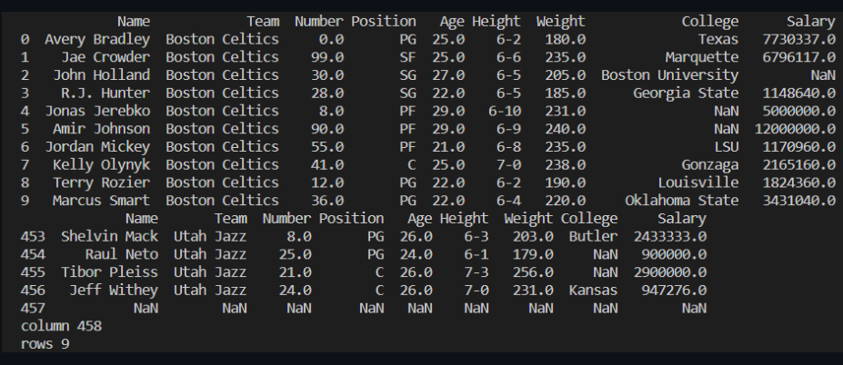

# Read-from-CSV

## AIM:
To write a program to raed from a CSV file

## ALGORITHM:
### Step 1:
Import pandas library
### Step 2:
Read the CSV file using df = pd.read_csv('nba.csv')
### Step 3:
Print the head and tail and the columns and rows
### Step 4:
Print the output
### Step 5:
End the program

## PROGRAM:
```
Read from CSV
Name: Nikhil M
Ref no: 22008584
```
```python
import pandas as pd
df = pd.read_csv('nba.csv')
print(df.head(10))
print(df.tail())
print("column",len(df,axes[0]))
print("rows",len.(df.axes[1]))
```

## OUTPUT:


## RESULT:
Thus a program to raed from a CSV file has been written successfully
